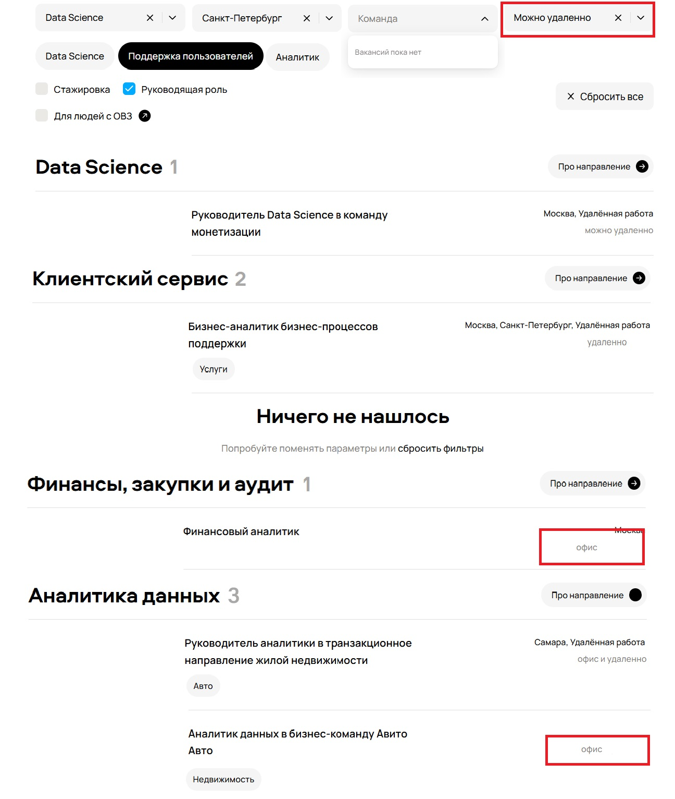
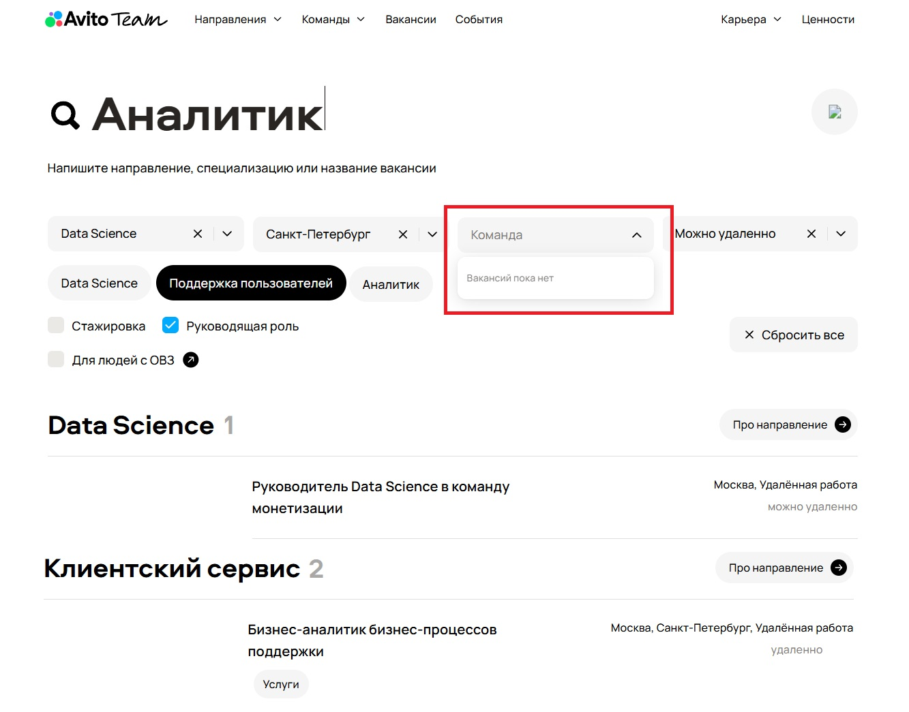
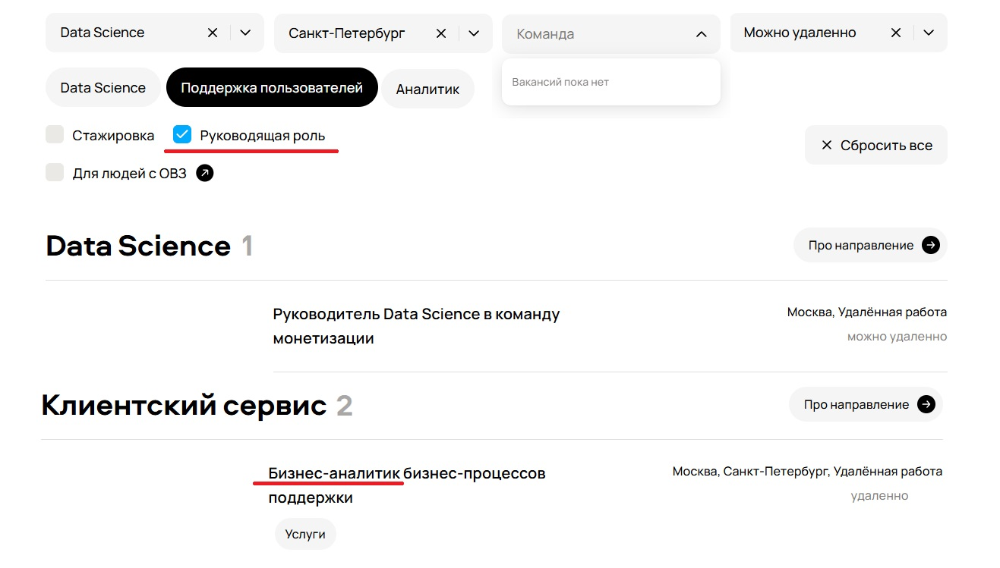
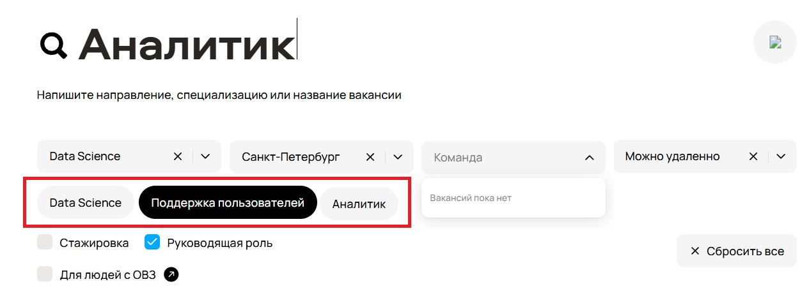
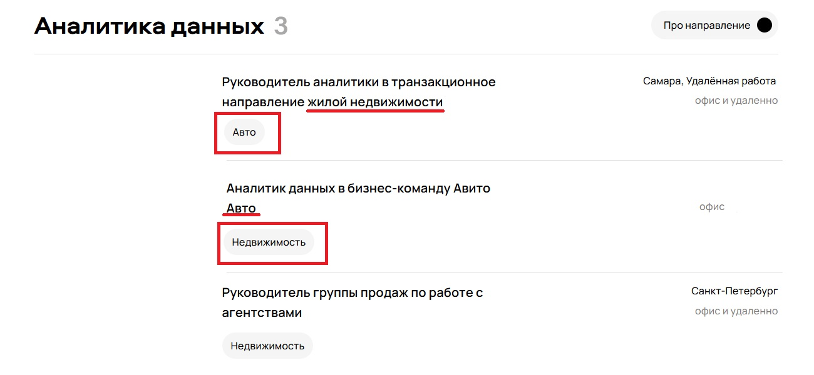
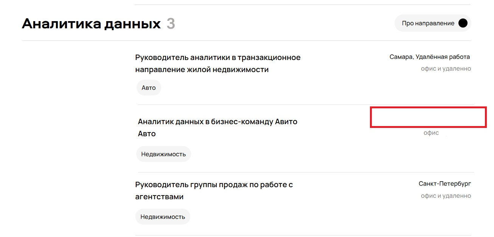

# Задание 1
№ | Краткое описание бага | Приоритет | Вложение 
--- | --- | --- | ---
1 | **Не отображается иконка в строке поиска вакансии** | Medium |  
2 | **Некорректно работает фильтр вакансий по городу** - отображаются вакансии, не относящиеся к выбранному городу | High |  
3 | **Некорректно работает фильтр формата работы** - отображаются вакансии, не соответствующие выбранному формату | High |  
4 | **Отображение "Вакансий пока нет" в фильтре "Команды" при наличии подходящих вакансиий** | Medium |  
5 | **Отсутствует стрелка на кнопке "Про направление" в разделе "Аналитика данных"** | Low |  
6 | **Отображение объявления "Ничего не нашлось" в разделе "Клиентский сервис"** | Medium |  
7 | **Некорректное отображение количества вакансий в разделе "Клиентский сервис"** | Low |  
8 | **Наличие вакансий на не руководящую должность при установки флага "Руководящая роль"** | High |  
9 | **Различные стили кнопок фильтров поднаправлений** | Medium |  
10 | **Отсутствие сферы деятельности компании в вакансиях** | Low |  
11 | **Неверно установлены сферы деятельности компаний в вакансиях** | Medium |  
12 | **Орфографическая опечатка "227 вакансии открыто" в подвале** | Low |  
13 | **Отсутсвие города в вакансии** | Low |  

P.S. Возможен баг в написании адресов офисов в подвале - зависит от устройства базы данных и верстки. 
Возможен баг в написании одновременно местоположения и формата работы в одной строке - зависит от требований.